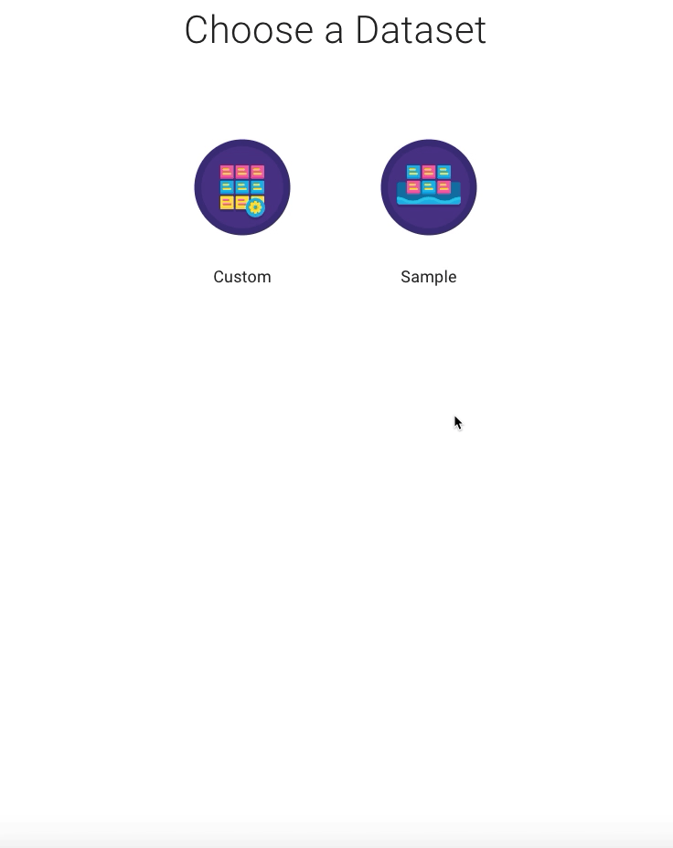
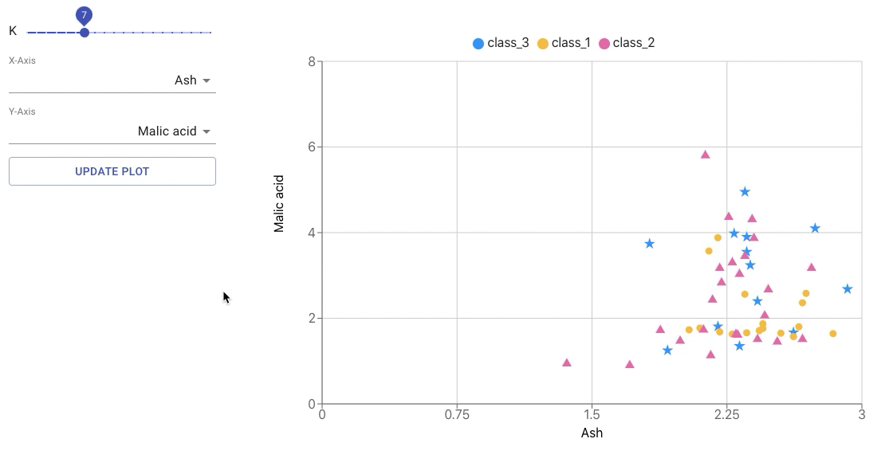

# Otto: Your friendly machine learning assistant.

## Build machine learning pipelines through a natural language experience
Otto is an intelligent chat application, designed to help aspiring machine learning engineers **go from idea to implementation with minimal domain knowledge**. [Our website](https://ottoml.online/) features easy model selection, insightful visualizations, and an intuitive natural language experience guiding you every step of the way. 

### _UPDATE: Otto is a winner at the Facebook AI Challenge!_

We're excited to share that Otto has received a **third-place prize** at the 2020 Facebook AI Challenge series for its innovative use of the [Wit.ai](https://wit.ai/) NLP platform. Congratulations to the other winners, and to everyone who participated! **[Check out our submission](https://devpost.com/software/otto-v05m26)**.

***

## Highlights

- **Beginner-friendly design.** Otto is made for novices, as it assumes minimal familiarity with machine learning. Users simply describe their end goals to obtain intelligent recommendations, or can choose from sample datasets to harness our models in an instant.

- **Powerful machine learning tools.** A range of machine learning capabilities are supported, including models for regression, classification and natural language processing, as well as preprocessors tailored to your problem. Play with neural networks, explore data visualizations, and generate ready-made Python code right in your browser!

- **Educational experience.** Users are walked through each stage of the process, with Otto explaining terminology when needed. Annotated code blocks provide eager learners a high-level understanding of their end-to-end pipeline.

***

## Quick Start

To demo some of Otto's core features, try out the following:

- **Say: _I want to label flower species by petal length_** to watch Otto prefill your pipeline components and visualize a nearest neighbors classification for the popular Iris dataset.

- **Select: _Regression > Sample Dataset_** to preview sample datasets for regression, and discover the strongest predictors using different best fit lines.

- **Say: _Detect fraudulent credit card activity_** and select the Custom Dataset option to experience Otto's model recommendation system and interactive neural network designer.

- **Say: _I'd like to interpret the mood of a review_** to query Wit-powered natural language models for live results.

And feel free to get creative! Come up with your own machine learning goals and see where Otto takes you.

## Stages

Below is a step-by-step breakdown of how Otto works.

### Task 

One of the biggest obstacles faced by those just getting started with ML is the abundance of jargon, from “loss functions” to “contour boundaries“ — beginners can't be expected to decide what model to use based on cryptic terminology, let alone develop one from scratch! Otto narrows down your options by inferring the high-level task at hand from a simple objective statement.

Task inference is powered by a Wit application (**Otto-Task**) trained on 300 such statements (e.g. “I want to detect loan applications as fraudulent”, “help me forecast stock prices”, or “let's summarize an article into a paragraph”) derived from real-world machine learning research. **Otto-Task** attempts to categorize the _task_ intent as regression, classification, or natural language processing, and additionally extracts a _subject_ entity embodying a streamlined form of the objective in order to filter out extraneous words. 

The subject is parsed for keyword matches (“tweets”, “housing”, etc) against our database of sample datasets. If a relevant dataset is found, Otto pulls the optimal task, model, and preprocessors for the dataset and pre-selects them for the user throughout the pipeline-building process. Otherwise, Otto issues a task recommendation based on the recognized intent. And if no intent was identified, the user is provided with some tips to help them pick the best task themselves.

### Dataset

Users are recommended a specific sample dataset matching their subject, or otherwise offered to preview and choose one themselves. Sample data allows beginners to prototype models quickly and easily, without the complexity of finding a dataset and figuring out the relevant features among dozens. Users may also opt to with their own data, which they can include later on in the generated code. 

### Model

If the user opted for custom data, Otto leverages Wit to perform the key step of selecting a classifier or regressor. A Wit client (**Otto-Model**) parses a brief user description of their data for key phrases indicating the desirability of a particular model. **Otto-Model** includes around 15 phrases and synonyms per model and performs fuzzy string matching, making it an effective and scalable technique for model recommendation.

A characterization of the classification dataset as “simple” or having “just a few columns”, would make the K-Nearest Neighbors algorithm a good choice, while a description of the regression data as “crime rates” or “annual consumer rankings” would suggest a Poisson or ordinal model, respectively. If no phrase is flagged, Otto will default to the most general model available: a Neural Network for classification, or a linear fit for regression. 

In the case of a natural language task, users can combine multiple models together for a more comprehensive analysis. Otto will recommend both sentiment analysis and entity recognition models, but provides users with information about both in case they'd like to adjust this. Our NLP models are built on a Wit backend (**Otto-NLP**) configured to identify [built-in traits and entities](https://wit.ai/docs/built-in-entities/20180601).

#### Supported models:

| Model Name          | Task             | Description                                                       |
|---------------------|------------------|-------------------------------------------------------------------|
| K-Nearest Neighbors | Classification   | Draws class regions by looking at surrounding data                |
| Neural Network      | Classification   | Deep learning model suitable for complex datasets                 |
| Linear              | Regression       | Ordinary linear relationship between variables                    |
| Poisson             | Regression       | Models count data, which tends to follow a Poisson distribution   |
| Ordinal             | Regression       | Learns rankings (e.g. "on a scale of 1-5")                        |
| Sentiment Analysis  | Natural Language | Detects polarity, expressions of thanks, and greetings/goodbyes   |
| Entity Recognition  | Natural Language | Extracts structures such as people, times & locations, and works of art |

### Preprocessors

What good is a fancy model if it takes ages to train? In this step, Otto swoops in with handpicked preprocessors for the user's data and model selections, abstracting away the intricacies of feature engineering and dimensionality reduction — machine learning techniques that optimize the data for efficient learning. As always, users can override the recommendations.

#### Supported preprocessors:
| Preprocessor Name            | Description                                                    |
|------------------------------|----------------------------------------------------------------|
| Principal Component Analysis | Performs dimensionality reduction and/or feature selection     |
| Normalization                | Scales data to have mean centered at 0 and unit variance       |
| Text Cleaning                | Removes emojis, noisy symbols, and leading/trailing whitespace |

### Visualization

The visualization stage activates for neural network design, or to render any models built on sample data.

#### Neural Network

Satisfy your curious mind with our fun, interactive network builder! 

Otto preconfigures a standard model architecture with [research-based](http://proceedings.mlr.press/v9/glorot10a/glorot10a.pdf) activations and initializers, but users are free to tinker with it layer by layer as they wish. Additionally, Otto can perform instant redesigns with the aid of a dedicated Wit model (**Otto-Net**) that translates user instructions into architecture changes.

#### Model Visualization (Sample)

Instantly explore how parameters affect KNN clusters and regression slopes!

### Code Display

All done! With your data sorted out, preprocessors set, and model configured, Otto gives you a nice view of your work. For convenience, we offer buttons to copy the code to your clipboard, deploy it to a Google Colab notebook, or restart the process. 

## What's Next for Otto?

Otto's modular design makes it readibly extensible, and its use of Wit means its natural language capabilities can be extended to even more domains. Here are just a few things planned for Otto:

- **More models**: logistic regression, support vector machines, decision trees
- **New tasks**: data generation (e.g. GANs), speech recognition
- **Smarter advice**: being able to ask Otto to explain machine learning concepts or describe the difference between options

## About

### Creators

 &nbsp; 

**Kartik Chugh**

Kartik is a second-year at the University of Virginia and currently an intern at Amazon's Alexa team. An avid open-source contributor, he is passionate about API design and developing cool machine learning tools! 

**Sanuj Bhatia**

Sanuj is a software engineer at Facebook who loves building interactive React-based applications. When possible, he likes to introduce and then fix bugs for maximum impact ;)

### Why Otto the Owl?

There's the alliteration, the portrait of the wise owl that comes to mind, the subtle use of [OttoML](https://en.wikipedia.org/wiki/Automated_machine_learning)..
